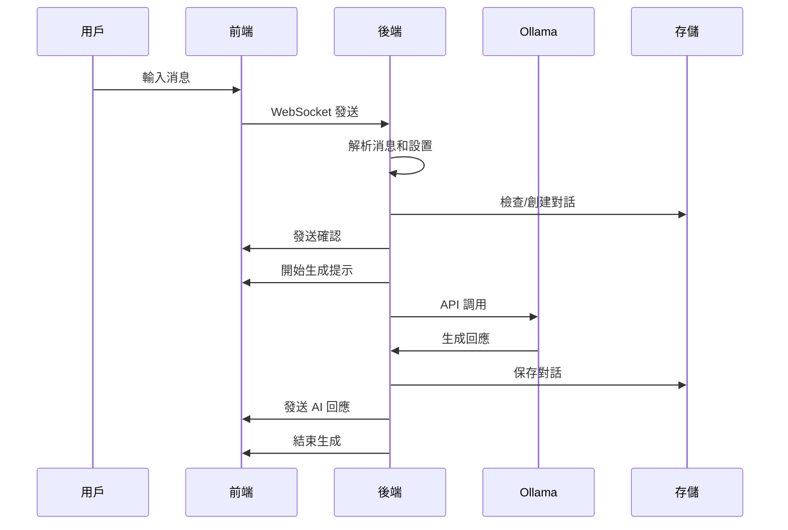

# GPT-OSS Ollama 版本 - 系統架構文檔

## 📋 整體架構概述

這是一個基於 **Ollama** 的本地AI對話系統，採用前後端分離的 Web 架構，提供快速、穩定的 AI 對話體驗。

```
┌─────────────────┐    WebSocket     ┌─────────────────┐    HTTP API    ┌─────────────────┐
│   前端 (Web)     │ ◄──────────────► │   後端 (Python)  │ ◄─────────────► │  Ollama 服務     │
│  index_new.html │                  │  app_ollama.py  │                │  gpt-oss:20b    │
└─────────────────┘                  └─────────────────┘                └─────────────────┘
```

## 🏗️ 核心組件

### 1. **啟動腳本** (`start_ollama.py`)

**功能**: 系統入口，負責環境檢查和服務啟動

**主要職責**:
- ✅ 檢查 Ollama 服務狀態
- ✅ 驗證 GPT-OSS:20B 模型可用性  
- ✅ 檢查 Python 依賴 (FastAPI, Uvicorn, aiohttp)
- ✅ 清理端口衝突 (端口 8000)
- ✅ 啟動後端服務
- ✅ 自動打開瀏覽器

**啟動指令**:
```bash
cd C:\Project\ChatGPT_OSS
python start_ollama.py
```

### 2. **後端服務** (`backend/app_ollama.py`)

**技術棧**: FastAPI + Uvicorn + AsyncIO
**運行端口**: 8000
**模型**: gpt-oss:20b (13GB)

#### 核心功能

1. **WebSocket 通信** - 即時雙向通信
2. **Ollama API 集成** - 與本地 Ollama 服務通信
3. **對話管理** - 會話歷史和上下文維護
4. **設置管理** - 支援溫度、回應長度等參數調整
5. **異步處理** - 非阻塞的任務處理和心跳機制

#### 主要 API 端點

| 方法 | 路徑 | 功能 |
|------|------|------|
| GET | `/` | 前端頁面服務 |
| GET | `/models` | 獲取可用模型列表 |
| GET | `/status` | 系統狀態檢查 |
| GET | `/conversations` | 獲取對話列表 |
| POST | `/conversations` | 創建新對話 |
| GET | `/conversations/{id}` | 獲取特定對話 |
| PUT | `/conversations/{id}/title` | 更新對話標題 |
| DELETE | `/conversations/{id}` | 刪除對話 |
| GET | `/conversations/search` | 搜索對話 |
| WS | `/ws/{session_id}` | WebSocket 連接 |

#### 回應模式設定

| 模式 | Temperature | Top-P | Top-K | 特點 |
|------|-------------|-------|-------|------|
| **平衡** (balanced) | 0.7 | 0.9 | 40 | 推薦設置，平衡創造性和準確性 |
| **創造性** (creative) | 0.7 | 0.95 | 60 | 更多樣化和創意性的回應 |
| **專注** (focused) | 0.7 | 0.8 | 20 | 更準確和專注的回應 |
| **詳細** (detailed) | 0.7 | 0.9 | 50 | 提供更詳細的說明 |

### 3. **前端界面** (`frontend/index_new.html`)

**技術**: HTML5 + JavaScript + CSS3 (無框架依賴)
**設計風格**: 仿 Ollama 官方界面

#### 主要特色

1. **單頁應用 (SPA)** - 無頁面刷新體驗
2. **實時通信** - WebSocket 即時對話
3. **響應式設計** - 適應不同螢幕尺寸
4. **對話歷史** - 左側邊欄顯示歷史對話
5. **設置面板** - 右側滑出式設置面板
6. **智能輸入** - 自動調整輸入框高度，支援多行輸入

#### UI 組件

```
┌─────────────────────────────────────────────────────────┐
│ GPT-OSS                                         [設定] │
├──────────────┬──────────────────────────────────────────┤
│ 左側邊欄      │              主對話區域                    │
│              │                                          │
│ □ 新對話      │  [Robot Icon] 歡迎使用 GPT-OSS            │
│ □ 設定        │                                          │
│              │  You: 你好                                │
│ 對話歷史:     │  AI:  你好！有什麼我可以幫助你的嗎？        │
│ • 對話1       │                                          │
│ • 對話2       │  ┌──────────────────────────────────────┐ │
│ • 對話3       │  │ 發送消息...                    [↑] │ │
│              │  └──────────────────────────────────────┘ │
└──────────────┴──────────────────────────────────────────┘
```

### 4. **對話存儲** (`backend/conversation_storage.py`)

**功能**: 持久化對話數據管理

**存儲結構**:
```
conversations/
├── index.json                    # 對話索引文件
└── data/
    ├── {uuid-1}.json            # 對話 1 的完整記錄
    ├── {uuid-2}.json            # 對話 2 的完整記錄
    └── ...
```

**數據格式**:
```json
{
  "id": "uuid",
  "session_id": "session-xxx",
  "title": "對話標題",
  "created_at": "2025-08-19T12:00:00Z",
  "updated_at": "2025-08-19T12:05:00Z",
  "messages": [
    {
      "user": "用戶消息",
      "assistant": "AI回應",
      "timestamp": "2025-08-19T12:01:00Z"
    }
  ]
}
```

## 🔄 系統數據流程

### 1. **用戶發送消息流程**



### 2. **對話歷史管理**

- **內存管理**: 保留最近 10 輪對話作為上下文
- **持久化**: 完整對話存儲在 JSON 文件中
- **上下文構建**: 自動構建包含歷史的提示

### 3. **錯誤處理機制**

```
異常類型             處理方式
├── WebSocket 斷開   → 自動重連 (3秒後)
├── Ollama 超時      → 返回超時消息
├── 任務取消         → 清理資源，返回中斷消息
├── API 錯誤         → 記錄日誌，返回錯誤提示
└── 存儲錯誤         → 重試機制，降級處理
```

## ⚙️ 關鍵技術特點

### 1. **異步處理架構**
- 使用 `asyncio` 處理高並發請求
- 非阻塞的 Ollama API 調用
- WebSocket 心跳機制維持連接穩定性

### 2. **智能任務管理**
- 避免過早任務取消 (修復原有 5 秒超時問題)
- 優雅的任務清理和錯誤恢復
- 連接斷開時自動取消相關任務

### 3. **性能優化策略**
- **快速回應機制**: 常見問候語立即回應
- **上下文長度控制**: 限制歷史對話數量 (最近 3 輪)
- **非流式響應**: 簡化處理邏輯，提高穩定性

### 4. **用戶體驗優化**
- **實時進度提示**: 顯示模型思考狀態
- **心跳顯示**: 每 5 秒更新進度 (持續到完成)
- **中斷和重試**: 支援回應中斷和重新發送

## 📁 詳細項目結構

```
ChatGPT_OSS/
├── start_ollama.py                   # 🚀 主啟動腳本
│
├── backend/                          # 🔧 後端服務
│   ├── app_ollama.py                # 主要後端服務 (FastAPI)
│   ├── conversation_storage.py      # 對話存儲管理
│   ├── conversations/               # 對話數據目錄
│   │   ├── index.json              # 對話索引
│   │   └── data/                   # 個別對話文件
│   └── requirements.txt            # Python 依賴
│
├── frontend/                         # 🎨 前端界面  
│   └── index_new.html              # 主要前端頁面 (SPA)
│
├── requirements_ollama.txt           # 🐍 Ollama 版本依賴
├── README_OLLAMA_START.md           # 📖 Ollama 版本說明
└── ARCHITECTURE.md                  # 📋 本架構文檔
```

## 🚀 系統優勢

### 1. **隱私保護**
- ✅ 完全本地運行，數據不離開本機
- ✅ 無需網絡連接進行 AI 對話
- ✅ 對話數據本地存儲和管理

### 2. **高性能體驗**
- ✅ 20B 參數模型提供高質量回應
- ✅ 優化的異步架構支援高並發
- ✅ 智能上下文管理提升回應速度

### 3. **易用性**
- ✅ 一鍵啟動，自動環境檢查
- ✅ 直觀的 Web 界面
- ✅ 完善的錯誤提示和恢復機制

### 4. **可擴展性**
- ✅ 模組化設計，易於修改和擴展
- ✅ 清晰的 API 接口定義
- ✅ 標準的 REST 和 WebSocket 協議

### 5. **穩定可靠**
- ✅ 完善的錯誤處理和日誌記錄
- ✅ 自動重連和任務恢復機制
- ✅ 經過測試和修復的核心邏輯

## 🔧 系統要求

### 硬體需求
- **CPU**: 建議 8 核心以上
- **記憶體**: 至少 16GB (建議 32GB)
- **存儲**: 至少 20GB 可用空間 (模型 13GB + 運行空間)
- **GPU**: 可選，支援 CUDA 可加速推理

### 軟體需求
- **操作系統**: Windows 10/11, macOS, Linux
- **Python**: 3.8+ 
- **Ollama**: 最新版本 (支援 gpt-oss:20b 模型)

### 網路需求
- **首次安裝**: 需要網路下載 Ollama 和模型 (約 13GB)
- **運行時**: 無需網路連接 (完全離線運行)

## 📚 使用指南

### 快速開始
1. **安裝 Ollama**: 
   ```bash
   # 下載並安裝 Ollama from https://ollama.ai
   ollama --version
   ```

2. **下載模型**:
   ```bash
   ollama pull gpt-oss:20b
   ```

3. **啟動系統**:
   ```bash
   cd C:\Project\ChatGPT_OSS
   python start_ollama.py
   ```

4. **開始對話**: 瀏覽器會自動打開 http://127.0.0.1:8000

### 高級設置
- **調整回應模式**: 點擊右上角設置按鈕
- **修改回應長度**: 512 ~ 4096 tokens
- **調整創造性**: Temperature 0.1 ~ 1.5
- **管理對話**: 左側邊欄查看、搜索、刪除歷史對話

---

## 🐛 故障排除

### 常見問題

1. **啟動失敗**: 檢查 Ollama 服務是否運行
2. **模型不可用**: 確認已下載 gpt-oss:20b 模型
3. **端口衝突**: 檢查端口 8000 是否被占用
4. **回應中斷**: 已修復，確保使用最新版本代碼

### 日誌位置
- **後端日誌**: 控制台輸出
- **Ollama 日誌**: Ollama 服務日誌
- **瀏覽器日誌**: F12 開發者工具 Console

---

*最後更新: 2025-08-19*
*版本: 4.0.0-ollama*